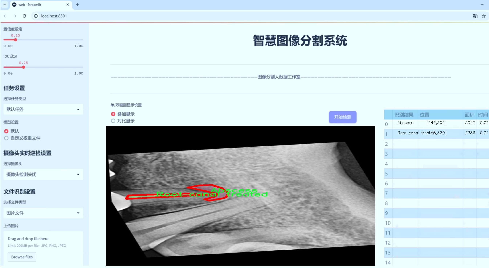
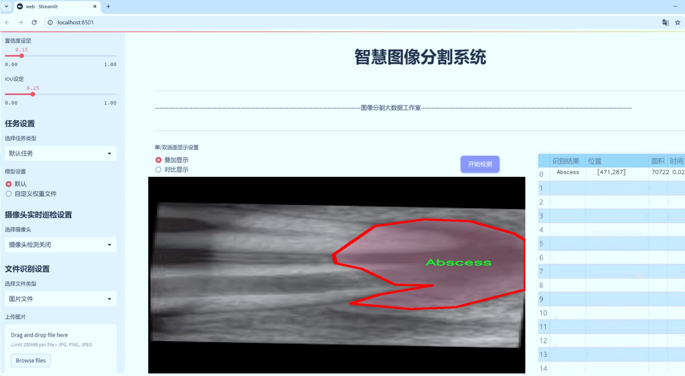
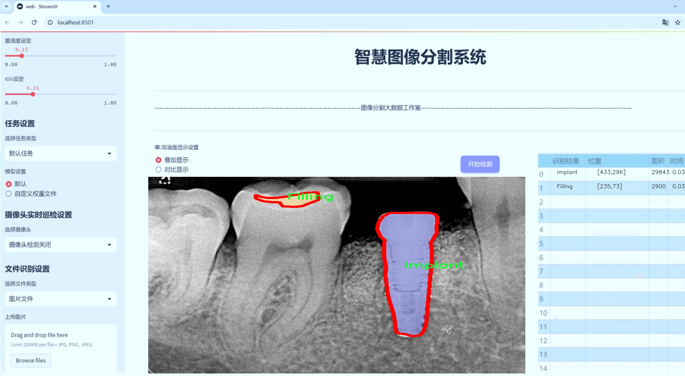
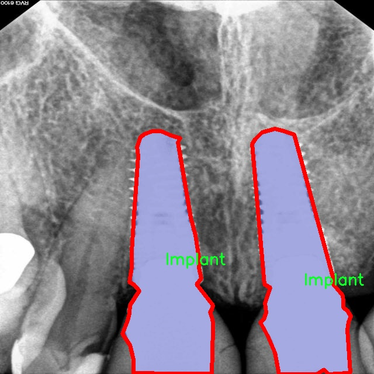
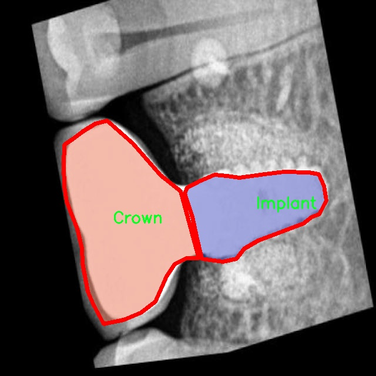
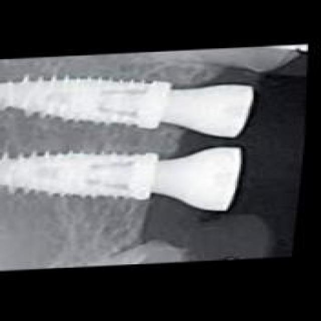
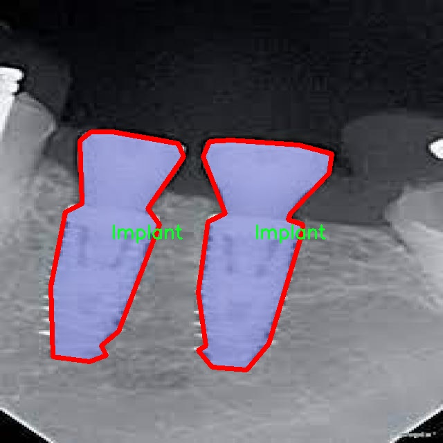
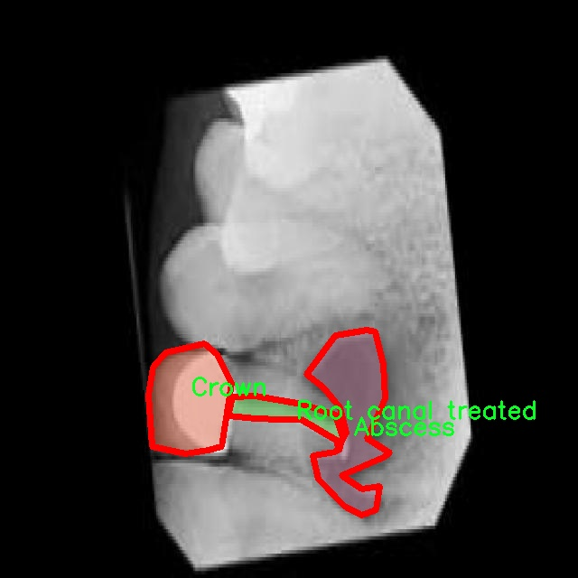

# 牙片牙齿病变图像分割系统源码＆数据集分享
 [yolov8-seg-slimneck＆yolov8-seg-RepHGNetV2等50+全套改进创新点发刊_一键训练教程_Web前端展示]

### 1.研究背景与意义

项目参考[ILSVRC ImageNet Large Scale Visual Recognition Challenge](https://gitee.com/YOLOv8_YOLOv11_Segmentation_Studio/projects)

项目来源[AAAI Global Al lnnovation Contest](https://kdocs.cn/l/cszuIiCKVNis)

研究背景与意义

随着口腔医学的不断发展，牙齿病变的早期诊断和精确治疗显得尤为重要。牙齿病变不仅影响患者的口腔健康，还可能导致全身性疾病的发生。因此，开发高效的牙齿病变图像分割系统，能够帮助牙科医生更好地识别和诊断各种牙齿病变，从而提高治疗效果，减轻患者痛苦。近年来，深度学习技术在医学图像处理领域取得了显著进展，尤其是目标检测和图像分割方面的应用，为牙科影像分析提供了新的解决方案。

YOLO（You Only Look Once）系列模型因其高效的实时处理能力和良好的检测精度，已成为图像分割领域的重要工具。YOLOv8作为该系列的最新版本，结合了更先进的网络结构和算法优化，能够在复杂的图像环境中实现高精度的目标检测和分割。然而，针对牙齿病变的特定需求，YOLOv8仍需进行改进，以适应牙片图像的特征和复杂性。

本研究基于改进YOLOv8，旨在构建一个高效的牙片牙齿病变图像分割系统。我们将使用名为“rvg-v1”的数据集，该数据集包含1100幅牙齿病变图像，涵盖18种不同的病变类别，包括脓肿、磨损、骨质流失、牙石、龋齿、牙冠、囊肿、填充物、骨折线、分叉、阻生牙、植体、神经、根管治疗、根片、窦道、未萌出牙等。这些丰富的样本为模型的训练和验证提供了坚实的基础。

通过对YOLOv8的改进，我们将重点解决以下几个问题：首先，如何提高模型在处理小目标（如牙齿病变）时的检测精度；其次，如何增强模型对不同病变类型的识别能力，以便在临床应用中提供更为准确的诊断支持；最后，如何优化模型的推理速度，以满足实时应用的需求。为此，我们将采用数据增强、迁移学习等技术手段，提升模型的泛化能力和鲁棒性。

本研究的意义不仅在于推动牙科影像分析技术的发展，更在于为临床医生提供一种高效、准确的工具，帮助他们在繁忙的工作中快速识别和处理牙齿病变。通过实现这一目标，我们希望能够提高牙科诊疗的效率，降低患者的就医成本，最终改善患者的口腔健康水平。此外，本研究还将为相关领域的研究提供新的思路和方法，推动医学图像处理技术的进一步发展。综上所述，基于改进YOLOv8的牙片牙齿病变图像分割系统的研究具有重要的学术价值和实际应用意义。

### 2.图片演示







##### 注意：由于此博客编辑较早，上面“2.图片演示”和“3.视频演示”展示的系统图片或者视频可能为老版本，新版本在老版本的基础上升级如下：（实际效果以升级的新版本为准）

  （1）适配了YOLOV8的“目标检测”模型和“实例分割”模型，通过加载相应的权重（.pt）文件即可自适应加载模型。

  （2）支持“图片识别”、“视频识别”、“摄像头实时识别”三种识别模式。

  （3）支持“图片识别”、“视频识别”、“摄像头实时识别”三种识别结果保存导出，解决手动导出（容易卡顿出现爆内存）存在的问题，识别完自动保存结果并导出到tempDir中。

  （4）支持Web前端系统中的标题、背景图等自定义修改，后面提供修改教程。

  另外本项目提供训练的数据集和训练教程,暂不提供权重文件（best.pt）,需要您按照教程进行训练后实现图片演示和Web前端界面演示的效果。

### 3.视频演示

[3.1 视频演示](https://www.bilibili.com/video/BV1bjS7YfEjW/)

### 4.数据集信息展示

##### 4.1 本项目数据集详细数据（类别数＆类别名）

nc: 18
names: ['Abscess', 'Attrition', 'Bone loss', 'Calculus', 'Caries', 'Crown', 'Cyst', 'Filling', 'Fracture line', 'Furcation', 'Impacted', 'Implant', 'Nerve', 'Root canal treated', 'Root piece', 'Sinus', 'Unerupted', 'object']


##### 4.2 本项目数据集信息介绍

数据集信息展示

在本研究中，我们采用了名为“rvg-v1”的数据集，以支持对牙片牙齿病变图像分割系统的训练，旨在改进YOLOv8-seg模型的性能。该数据集专门为牙科影像分析而设计，涵盖了多种常见的牙齿病变类型，具有重要的临床应用价值。数据集的类别数量为18，涵盖了从常见的牙齿病变到复杂的牙科情况，提供了丰富的样本以供深度学习模型进行训练和验证。

“rvg-v1”数据集中的类别包括：脓肿（Abscess）、磨损（Attrition）、骨丧失（Bone loss）、牙石（Calculus）、龋齿（Caries）、牙冠（Crown）、囊肿（Cyst）、填充物（Filling）、骨折线（Fracture line）、分叉（Furcation）、阻生牙（Impacted）、植体（Implant）、神经（Nerve）、根管治疗（Root canal treated）、根片（Root piece）、窦道（Sinus）、未萌出牙（Unerupted）以及一个通用类别（object）。这些类别不仅涵盖了牙齿常见的病变，还包括了一些较为复杂的牙科情况，能够帮助模型更全面地理解和识别牙科影像中的不同病变特征。

在数据集的构建过程中，所有样本均经过专业牙科医生的标注和审核，确保了数据的准确性和可靠性。这一过程不仅提高了数据集的质量，也为后续的模型训练提供了坚实的基础。每个类别的样本数量经过精心设计，以保证模型在训练过程中能够接触到足够多的实例，从而提高其泛化能力和识别精度。

在训练过程中，YOLOv8-seg模型将利用这些标注数据进行学习，掌握不同牙齿病变的特征和表现形式。通过对“rvg-v1”数据集的深度学习，模型能够在复杂的牙片图像中准确分割出各类病变区域，进而为临床诊断提供辅助支持。这种自动化的图像分割技术，不仅能够提高牙科医生的工作效率，还能减少人为错误，提高诊断的准确性。

此外，数据集的多样性和丰富性使得模型在面对不同类型的牙科影像时，能够展现出良好的适应性和鲁棒性。随着训练的深入，模型将不断优化其参数，逐步提高对牙齿病变的识别能力。最终，我们期望通过这一研究，能够开发出一套高效、准确的牙片病变图像分割系统，为牙科领域的智能化发展贡献力量。

综上所述，“rvg-v1”数据集不仅为本研究提供了丰富的训练样本，也为改进YOLOv8-seg模型的性能奠定了坚实的基础。通过对该数据集的深入分析和利用，我们相信能够实现更高效的牙齿病变识别与分割，为临床牙科诊断提供强有力的技术支持。











### 5.全套项目环境部署视频教程（零基础手把手教学）

[5.1 环境部署教程链接（零基础手把手教学）](https://www.bilibili.com/video/BV1jG4Ve4E9t/?vd_source=bc9aec86d164b67a7004b996143742dc)


[5.2 安装Python虚拟环境创建和依赖库安装视频教程链接（零基础手把手教学）](https://www.bilibili.com/video/BV1nA4VeYEze/?vd_source=bc9aec86d164b67a7004b996143742dc)

### 6.手把手YOLOV8-seg训练视频教程（零基础小白有手就能学会）

[6.1 手把手YOLOV8-seg训练视频教程（零基础小白有手就能学会）](https://www.bilibili.com/video/BV1cA4VeYETe/?vd_source=bc9aec86d164b67a7004b996143742dc)


按照上面的训练视频教程链接加载项目提供的数据集，运行train.py即可开始训练



     Epoch   gpu_mem       box       obj       cls    labels  img_size
     1/200     0G   0.01576   0.01955  0.007536        22      1280: 100%|██████████| 849/849 [14:42<00:00,  1.04s/it]
               Class     Images     Labels          P          R     mAP@.5 mAP@.5:.95: 100%|██████████| 213/213 [01:14<00:00,  2.87it/s]
                 all       3395      17314      0.994      0.957      0.0957      0.0843

     Epoch   gpu_mem       box       obj       cls    labels  img_size
     2/200     0G   0.01578   0.01923  0.007006        22      1280: 100%|██████████| 849/849 [14:44<00:00,  1.04s/it]
               Class     Images     Labels          P          R     mAP@.5 mAP@.5:.95: 100%|██████████| 213/213 [01:12<00:00,  2.95it/s]
                 all       3395      17314      0.996      0.956      0.0957      0.0845

     Epoch   gpu_mem       box       obj       cls    labels  img_size
     3/200     0G   0.01561    0.0191  0.006895        27      1280: 100%|██████████| 849/849 [10:56<00:00,  1.29it/s]
               Class     Images     Labels          P          R     mAP@.5 mAP@.5:.95: 100%|███████   | 187/213 [00:52<00:00,  4.04it/s]
                 all       3395      17314      0.996      0.957      0.0957      0.0845


### 7.50+种全套YOLOV8-seg创新点代码加载调参视频教程（一键加载写好的改进模型的配置文件）

[7.1 50+种全套YOLOV8-seg创新点代码加载调参视频教程（一键加载写好的改进模型的配置文件）](https://www.bilibili.com/video/BV1Hw4VePEXv/?vd_source=bc9aec86d164b67a7004b996143742dc)

### 8.YOLOV8-seg图像分割算法原理

原始YOLOV8-seg算法原理

YOLOv8-seg算法是YOLO系列目标检测算法的最新版本，基于YOLOv8的架构进行扩展，旨在实现更高效的图像分割与目标检测。YOLO系列算法自诞生以来，便以其高效的单阶段检测方式和优越的实时性能而受到广泛关注。YOLOv8作为这一系列的最新进化，继承了前几代算法的优点，并在多个方面进行了创新和优化，尤其是在特征提取、特征融合和目标检测精度等方面。

YOLOv8-seg的网络结构主要由输入层、Backbone骨干网络、Neck特征融合网络和Head检测模块四个部分组成。输入层负责对输入图像进行预处理，包括图像的缩放、增强等操作，以提高模型的鲁棒性和适应性。YOLOv8-seg采用了Mosaic增强、Mixup、随机透视变换和颜色扰动等多种数据增强手段，以丰富训练样本的多样性，从而提升模型的泛化能力。

在Backbone部分，YOLOv8-seg依然采用了CSPDarknet结构，但对其进行了改进，使用C2f模块替代了C3模块。C2f模块的设计灵感来源于YOLOv7的ELAN思想，通过引入多个分支和Bottleneck结构，增强了特征的流动性和梯度的传递效率。这种结构的优势在于能够更好地捕捉图像中的细节信息，同时保持网络的轻量化特性，确保在实时检测中的高效性。

特征融合是YOLOv8-seg的一个重要环节，Neck部分采用了PAN-FPN结构，这种结构通过自下而上的特征融合和自上而下的特征传递，充分利用了不同层次的特征信息。具体而言，YOLOv8-seg通过将高层特征与中层特征和浅层特征进行融合，增强了模型对不同尺度目标的检测能力。这种多尺度特征融合的方式，使得YOLOv8-seg在处理复杂场景时，能够更准确地识别和分割目标。

在Head模块中，YOLOv8-seg采用了解耦头的结构，将分类和回归任务分开处理。与传统的耦合头结构不同，解耦头允许模型在分类和定位上进行独立优化，从而提高了检测精度和速度。YOLOv8-seg的Head部分输出多个尺度的特征图，分别对应不同大小的目标，通过Softmax和卷积操作将预测结果转化为边框和类别信息。这种设计使得YOLOv8-seg能够有效地处理小目标和大目标，提升了模型的适用性。

在损失函数的设计上，YOLOv8-seg引入了Varifocal Loss（VFLLoss）和CIoULoss作为主要的损失函数。这些损失函数通过动态调整正负样本的权重，解决了训练过程中样本不平衡的问题。VFLLoss通过对正样本和负样本进行不同程度的惩罚，确保模型能够更好地关注难以分类的样本，提高了模型的整体性能。

YOLOv8-seg在标签分配策略上也进行了创新，采用了Task-Aligned的Assigner匹配方式。这种动态标签分配策略使得模型能够更灵活地适应不同数据集的特征，避免了静态匹配带来的局限性。通过这种方式，YOLOv8-seg能够在多种场景下实现高效的目标检测和分割。

综上所述，YOLOv8-seg算法在YOLOv8的基础上，通过改进Backbone结构、优化特征融合方式、采用解耦头设计以及引入先进的损失函数和标签分配策略，显著提升了目标检测和图像分割的性能。其高效的实时处理能力和优越的检测精度，使得YOLOv8-seg在计算机视觉领域中具有广泛的应用前景，尤其是在自动驾驶、安防监控和智能交通等场景中，能够为实时目标检测和分割提供强有力的支持。


### 9.系统功能展示（检测对象为举例，实际内容以本项目数据集为准）

图9.1.系统支持检测结果表格显示

  图9.2.系统支持置信度和IOU阈值手动调节

  图9.3.系统支持自定义加载权重文件best.pt(需要你通过步骤5中训练获得)

  图9.4.系统支持摄像头实时识别

  图9.5.系统支持图片识别

  图9.6.系统支持视频识别

  图9.7.系统支持识别结果文件自动保存

  图9.8.系统支持Excel导出检测结果数据


### 10.50+种全套YOLOV8-seg创新点原理讲解（非科班也可以轻松写刊发刊，V11版本正在科研待更新）

#### 10.1 由于篇幅限制，每个创新点的具体原理讲解就不一一展开，具体见下列网址中的创新点对应子项目的技术原理博客网址【Blog】：


[10.1 50+种全套YOLOV8-seg创新点原理讲解链接](https://gitee.com/qunmasj/good)

#### 10.2 部分改进模块原理讲解(完整的改进原理见上图和技术博客链接)【如果此小节的图加载失败可以通过CSDN或者Github搜索该博客的标题访问原始博客，原始博客图片显示正常】
### CBAM空间注意力机制
近年来，随着深度学习研究方向的火热，注意力机制也被广泛地应用在图像识别、语音识别和自然语言处理等领域，注意力机制在深度学习任务中发挥着举足轻重的作用。注意力机制借鉴于人类的视觉系统，例如，人眼在看到一幅画面时，会倾向于关注画面中的重要信息，而忽略其他可见的信息。深度学习中的注意力机制和人类视觉的注意力机制相似，通过扫描全局数据，从大量数据中选择出需要重点关注的、对当前任务更为重要的信息，然后对这部分信息分配更多的注意力资源，从这些信息中获取更多所需要的细节信息，而抑制其他无用的信息。而在深度学习中，则具体表现为给感兴趣的区域更高的权重，经过网络的学习和调整，得到最优的权重分配，形成网络模型的注意力，使网络拥有更强的学习能力，加快网络的收敛速度。
注意力机制通常可分为软注意力机制和硬注意力机制[4-5]。软注意力机制在选择信息时，不是从输入的信息中只选择1个，而会用到所有输入信息，只是各个信息对应的权重分配不同，然后输入网络模型进行计算;硬注意力机制则是从输入的信息中随机选取一个或者选择概率最高的信息，但是这一步骤通常是不可微的，导致硬注意力机制更难训练。因此，软注意力机制应用更为广泛，按照原理可将软注意力机制划分为:通道注意力机制（channel attention)、空间注意力机制(spatial attention）和混合域注意力机制(mixed attention)。
通道注意力机制的本质建立各个特征通道之间的重要程度，对感兴趣的通道进行重点关注，弱化不感兴趣的通道的作用;空间注意力的本质则是建模了整个空间信息的重要程度，然后对空间内感兴趣的区域进行重点关注，弱化其余非感兴趣区域的作用;混合注意力同时运用了通道注意力和空间注意力，两部分先后进行或并行，形成对通道特征和空间特征同时关注的注意力模型。

卷积层注意力模块(Convolutional Block Attention Module，CBAM）是比较常用的混合注意力模块，其先后集中了通道注意力模块和空间注意力模块，网络中加入该模块能有效提高网络性能，减少网络模型的计算量，模块结构如图所示。输入特征图首先经过分支的通道注意力模块，然后和主干的原特征图融合，得到具有通道注意力的特征图，接着经过分支的空间注意力模块，在和主干的特征图融合后，得到同时具有通道特征注意力和空间特征注意力的特征图。CBAM模块不改变输入特征图的大小，因此该模块是一个“即插即用”的模块，可以插入网络的任何位置。

通道注意力模块的结构示意图如图所示，通道注意力模块分支并行地对输入的特征图进行最大池化操作和平均池化操作，然后利用多层感知机对结果进行变换，得到应用于两个通道的变换结果，最后经过sigmoid激活函数将变换结果融合，得到具有通道注意力的通道特征图。

空间注意力模块示意图如图所示，将通道注意力模块输出的特征图作为该模块的输入特征图，首先对输入特征图进行基于通道的最大池化操作和平均池化操作，将两部分得到的结果拼接起来，然后通过卷积得到降为Ⅰ通道的特征图，最后通过sigmoid激活函数生成具有空间注意力的特征图。


### 11.项目核心源码讲解（再也不用担心看不懂代码逻辑）

#### 11.1 ultralytics\nn\modules\block.py

以下是对代码中最核心部分的提取和详细注释。主要保留了YOLO模型中的重要模块，包括DFL、Proto、HGStem、HGBlock、SPP、CSP Bottleneck等。每个模块都附有详细的中文注释，以便理解其功能和结构。

```python
import torch
import torch.nn as nn
import torch.nn.functional as F

class DFL(nn.Module):
    """
    分布焦点损失（DFL）模块，主要用于目标检测中的损失计算。
    """
    def __init__(self, c1=16):
        """初始化DFL模块，创建一个卷积层用于处理输入通道。"""
        super().__init__()
        # 创建一个1x1卷积层，将输入通道数转换为1
        self.conv = nn.Conv2d(c1, 1, 1, bias=False).requires_grad_(False)
        # 初始化卷积层的权重为[0, 1, ..., c1-1]
        x = torch.arange(c1, dtype=torch.float)
        self.conv.weight.data[:] = nn.Parameter(x.view(1, c1, 1, 1))
        self.c1 = c1

    def forward(self, x):
        """前向传播，应用DFL计算。"""
        b, c, a = x.shape  # b: batch size, c: channels, a: anchors
        # 变形并应用softmax，然后通过卷积层
        return self.conv(x.view(b, 4, self.c1, a).transpose(2, 1).softmax(1)).view(b, 4, a)

class Proto(nn.Module):
    """YOLOv8的掩码原型模块，用于分割模型。"""
    def __init__(self, c1, c_=256, c2=32):
        """初始化Proto模块，设置输入和输出通道。"""
        super().__init__()
        self.cv1 = Conv(c1, c_, k=3)  # 第一个卷积层
        self.upsample = nn.ConvTranspose2d(c_, c_, 2, 2, 0, bias=True)  # 上采样层
        self.cv2 = Conv(c_, c_, k=3)  # 第二个卷积层
        self.cv3 = Conv(c_, c2)  # 输出卷积层

    def forward(self, x):
        """前向传播，经过一系列卷积和上采样。"""
        return self.cv3(self.cv2(self.upsample(self.cv1(x))))

class HGStem(nn.Module):
    """
    PPHGNetV2的StemBlock，包含多个卷积层和一个最大池化层。
    """
    def __init__(self, c1, cm, c2):
        """初始化Stem模块，设置输入输出通道。"""
        super().__init__()
        self.stem1 = Conv(c1, cm, 3, 2)  # 第一个卷积层
        self.stem2a = Conv(cm, cm // 2, 2, 1, 0)  # 第二个卷积层
        self.stem2b = Conv(cm // 2, cm, 2, 1, 0)  # 第三个卷积层
        self.stem3 = Conv(cm * 2, cm, 3, 2)  # 第四个卷积层
        self.stem4 = Conv(cm, c2, 1, 1)  # 输出卷积层
        self.pool = nn.MaxPool2d(kernel_size=2, stride=1, padding=0, ceil_mode=True)  # 最大池化层

    def forward(self, x):
        """前向传播，经过多个卷积和池化操作。"""
        x = self.stem1(x)
        x = F.pad(x, [0, 1, 0, 1])  # 填充
        x2 = self.stem2a(x)
        x2 = F.pad(x2, [0, 1, 0, 1])  # 填充
        x2 = self.stem2b(x2)
        x1 = self.pool(x)  # 最大池化
        x = torch.cat([x1, x2], dim=1)  # 拼接
        x = self.stem3(x)
        x = self.stem4(x)
        return x

class C3(nn.Module):
    """CSP Bottleneck模块，包含3个卷积层。"""
    def __init__(self, c1, c2, n=1, shortcut=True, g=1, e=0.5):
        """初始化C3模块，设置输入输出通道和其他参数。"""
        super().__init__()
        c_ = int(c2 * e)  # 隐藏通道数
        self.cv1 = Conv(c1, c_, 1, 1)  # 第一个卷积层
        self.cv2 = Conv(c1, c_, 1, 1)  # 第二个卷积层
        self.cv3 = Conv(2 * c_, c2, 1)  # 输出卷积层
        self.m = nn.Sequential(*(Bottleneck(c_, c_, shortcut, g, k=((1, 1), (3, 3)), e=1.0) for _ in range(n)))  # Bottleneck序列

    def forward(self, x):
        """前向传播，经过CSP Bottleneck处理。"""
        return self.cv3(torch.cat((self.m(self.cv1(x)), self.cv2(x)), 1))  # 拼接并通过输出卷积层

class Bottleneck(nn.Module):
    """标准的Bottleneck模块。"""
    def __init__(self, c1, c2, shortcut=True, g=1, k=(3, 3), e=0.5):
        """初始化Bottleneck模块，设置输入输出通道和其他参数。"""
        super().__init__()
        c_ = int(c2 * e)  # 隐藏通道数
        self.cv1 = Conv(c1, c_, k[0], 1)  # 第一个卷积层
        self.cv2 = Conv(c_, c2, k[1], 1, g=g)  # 第二个卷积层
        self.add = shortcut and c1 == c2  # 是否使用shortcut连接

    def forward(self, x):
        """前向传播，应用Bottleneck处理。"""
        return x + self.cv2(self.cv1(x)) if self.add else self.cv2(self.cv1(x))  # 使用shortcut连接

# 以上是YOLO模型中的核心模块，包含DFL、Proto、HGStem、C3和Bottleneck等，提供了基础的卷积操作和结构。
```

这些模块是YOLO模型的核心部分，负责特征提取和损失计算。每个模块都有其特定的功能，组合在一起形成了一个完整的目标检测网络。

该文件是Ultralytics YOLO模型的一部分，主要实现了一些基本的神经网络模块，特别是用于目标检测和分割的模块。文件中包含多个类，每个类代表一个特定的网络结构或操作。以下是对文件中主要类和功能的逐一说明。

首先，文件引入了PyTorch库，并定义了一些基本的卷积操作类，包括标准卷积、深度可分离卷积、Ghost卷积等。这些卷积类在后续的网络模块中被广泛使用。

DFL类实现了分布焦点损失（Distribution Focal Loss），这是在目标检测中常用的一种损失函数。它通过一个卷积层将输入的特征图转换为损失值，适用于处理类别不平衡的问题。

Proto类用于YOLOv8模型中的掩膜原型模块，主要用于分割任务。它通过一系列卷积和上采样操作来生成分割掩膜。

HGStem类是PPHGNetV2的StemBlock部分，包含多个卷积层和一个最大池化层。它的作用是提取输入图像的特征，并逐步减少特征图的尺寸。

HGBlock类也是PPHGNetV2的一部分，包含多个卷积层和LightConv。它的设计目的是通过多层卷积提取更深层次的特征，并通过短路连接（shortcut）来增强特征的传递。

SPP类实现了空间金字塔池化（Spatial Pyramid Pooling），用于处理不同尺度的特征图，以提高模型对多尺度目标的检测能力。它通过不同大小的池化操作来提取特征。

SPPF类是SPP的快速实现，旨在提高计算效率，适用于YOLOv5模型。

C1、C2、C2f、C3等类实现了不同类型的CSP（Cross Stage Partial）瓶颈结构，这些结构通过分离和重组特征图来提高模型的表达能力和计算效率。C2f类是C2的更快实现，C3类则引入了更多的卷积层以增强特征提取能力。

RepC3类是一个重复的C3模块，主要用于构建更深的网络结构。C3TR和C3Ghost类分别结合了TransformerBlock和GhostBottleneck，进一步增强了模型的特征提取能力。

GhostBottleneck类实现了GhostNet中的瓶颈结构，旨在通过减少参数数量来提高计算效率，同时保持模型的性能。

Bottleneck和BottleneckCSP类实现了标准的瓶颈结构和CSP瓶颈结构，分别用于构建深度神经网络的基本单元。

总体而言，这个文件定义了一系列用于构建YOLO和其他目标检测模型的基础模块，利用卷积、池化和短路连接等操作来提取和处理特征。这些模块的设计旨在提高模型的性能和计算效率，使其能够更好地处理复杂的视觉任务。

#### 11.2 ultralytics\engine\tuner.py

以下是经过简化并注释的核心代码部分，主要保留了超参数调优的核心逻辑和流程：

```python
import random
import shutil
import subprocess
import time
import numpy as np
import torch
from ultralytics.cfg import get_cfg, get_save_dir
from ultralytics.utils import LOGGER, callbacks, yaml_save, yaml_print
from ultralytics.utils.plotting import plot_tune_results

class Tuner:
    """
    负责YOLO模型超参数调优的类。

    该类通过在给定的迭代次数内变异超参数，并重新训练模型来评估其性能。
    """

    def __init__(self, args):
        """
        初始化Tuner类。

        Args:
            args (dict): 超参数演化的配置。
        """
        self.args = get_cfg(overrides=args)  # 获取配置
        self.space = {  # 定义超参数搜索空间及其范围
            'lr0': (1e-5, 1e-1),  # 初始学习率
            'lrf': (0.0001, 0.1),  # 最终学习率
            'momentum': (0.7, 0.98, 0.3),  # 动量
            'weight_decay': (0.0, 0.001),  # 权重衰减
            # 其他超参数...
        }
        self.tune_dir = get_save_dir(self.args, name='tune')  # 获取保存目录
        self.tune_csv = self.tune_dir / 'tune_results.csv'  # CSV文件路径
        self.callbacks = callbacks.get_default_callbacks()  # 获取默认回调
        LOGGER.info(f"Initialized Tuner instance with 'tune_dir={self.tune_dir}'")

    def _mutate(self):
        """
        根据搜索空间变异超参数。

        Returns:
            dict: 包含变异后超参数的字典。
        """
        # 从CSV文件中加载已有的超参数并选择最佳的进行变异
        if self.tune_csv.exists():
            x = np.loadtxt(self.tune_csv, ndmin=2, delimiter=',', skiprows=1)
            fitness = x[:, 0]  # 获取适应度
            n = min(5, len(x))  # 考虑的最佳结果数量
            x = x[np.argsort(-fitness)][:n]  # 选择适应度最高的n个
            # 选择父代并进行变异
            # ...（省略选择和变异的具体实现）

        else:
            hyp = {k: getattr(self.args, k) for k in self.space.keys()}  # 初始化超参数

        # 限制超参数在定义的范围内
        for k, v in self.space.items():
            hyp[k] = max(hyp[k], v[0])  # 下限
            hyp[k] = min(hyp[k], v[1])  # 上限
            hyp[k] = round(hyp[k], 5)  # 保留五位小数

        return hyp

    def __call__(self, model=None, iterations=10):
        """
        执行超参数演化过程。

        Args:
            model (Model): 预初始化的YOLO模型。
            iterations (int): 演化的代数。
        """
        for i in range(iterations):
            mutated_hyp = self._mutate()  # 变异超参数
            LOGGER.info(f'Starting iteration {i + 1}/{iterations} with hyperparameters: {mutated_hyp}')

            # 训练YOLO模型
            train_args = {**vars(self.args), **mutated_hyp}  # 合并超参数
            cmd = ['yolo', 'train', *(f'{k}={v}' for k, v in train_args.items())]  # 训练命令
            try:
                assert subprocess.run(cmd, check=True).returncode == 0, 'training failed'  # 执行训练
                # 记录训练结果
                # ...（省略记录和保存结果的具体实现）

            except Exception as e:
                LOGGER.warning(f'Training failure for iteration {i + 1}\n{e}')

            # 保存和打印调优结果
            # ...（省略保存和打印结果的具体实现）
```

### 代码说明：
1. **Tuner类**：负责超参数调优的核心类，包含初始化、变异超参数和执行调优的主要逻辑。
2. **初始化方法**：设置超参数的搜索空间和保存目录，并记录初始化信息。
3. **_mutate方法**：根据已有的超参数选择最佳的进行变异，并确保变异后的超参数在定义的范围内。
4. **__call__方法**：执行超参数调优的主要流程，包括变异超参数、训练模型和记录结果。

此代码段保留了超参数调优的核心逻辑，并进行了详细的中文注释，以便理解其功能和流程。

这个程序文件 `ultralytics\engine\tuner.py` 是用于超参数调优的模块，专门针对 Ultralytics YOLO 模型进行对象检测、实例分割、图像分类、姿态估计和多目标跟踪等任务。超参数调优是一个系统性地搜索最佳超参数集的过程，以获得最佳的模型性能。在深度学习模型如 YOLO 中，超参数的微小变化可能会导致模型准确性和效率的显著差异。

文件中定义了一个 `Tuner` 类，负责 YOLO 模型的超参数调优。该类通过在给定的迭代次数内变异超参数，并重新训练模型来评估其性能。类的属性包括超参数搜索空间、调优结果保存目录以及调优结果的 CSV 文件路径。类的方法包括 `_mutate`，用于在指定的边界内变异超参数，以及 `__call__`，用于执行超参数进化过程。

在初始化 `Tuner` 类时，会设置超参数的搜索空间，包括学习率、动量、权重衰减等多个参数的最小值和最大值，以及其他与数据增强相关的参数。调优结果会被保存到指定的目录和 CSV 文件中。

`_mutate` 方法用于根据指定的边界和缩放因子变异超参数。该方法会选择最佳的父超参数进行变异，并确保生成的超参数在预设的边界内。`__call__` 方法则是调优的核心，负责迭代执行超参数的变异、模型训练和结果记录。每次迭代中，首先加载或初始化超参数，然后进行变异，接着用变异后的超参数训练 YOLO 模型，并将训练结果和超参数记录到 CSV 文件中。

在每次迭代结束后，程序会检查当前迭代的性能是否优于之前的最佳结果，并根据需要保存模型权重和超参数。最后，程序会生成调优结果的可视化图表，并将最佳超参数保存为 YAML 文件，方便后续使用。

总的来说，这个模块为 YOLO 模型的超参数调优提供了一个系统化的框架，通过迭代和变异来寻找最佳的超参数组合，以提升模型的性能。

#### 11.3 ultralytics\models\sam\modules\__init__.py

以下是代码的核心部分，并附上详细的中文注释：

```python
# Ultralytics YOLO 🚀, AGPL-3.0 license

# 导入必要的库
import torch  # 导入PyTorch库，用于深度学习
from models.experimental import attempt_load  # 从模型模块导入尝试加载模型的函数
from utils.datasets import LoadImages  # 从数据集模块导入加载图像的类
from utils.general import check_img_size, non_max_suppression  # 导入通用工具函数
from utils.torch_utils import select_device  # 导入选择设备的函数

# 设置设备（CPU或GPU）
device = select_device('')  # 选择可用的设备，默认为空表示自动选择

# 加载YOLO模型
model = attempt_load('yolov5s.pt', map_location=device)  # 加载预训练的YOLOv5s模型

# 检查输入图像的大小
img_size = check_img_size(640, s=model.stride.max())  # 检查640是否是模型支持的输入大小

# 加载图像
dataset = LoadImages('data/images', img_size=img_size)  # 从指定路径加载图像数据集

# 进行推理
for path, img, im0s, vid_cap in dataset:  # 遍历数据集中的每一张图像
    img = torch.from_numpy(img).to(device).float()  # 将图像转换为Tensor并移动到设备上
    img /= 255.0  # 将像素值归一化到[0, 1]范围

    # 进行模型推理
    pred = model(img[None], augment=False)[0]  # 执行前向传播，获取预测结果

    # 应用非极大值抑制，过滤重叠的检测框
    pred = non_max_suppression(pred, conf_thres=0.25, iou_thres=0.45)  # 进行NMS处理

    # 处理检测结果
    for det in pred:  # 遍历每个检测结果
        if len(det):  # 如果检测到目标
            # 处理每个检测框的坐标和类别
            pass  # 此处可以添加处理代码，例如绘制框、输出结果等
```

### 注释说明：
1. **导入库**：导入必要的库和模块，以便后续使用。
2. **设备选择**：选择运行模型的设备（CPU或GPU），以提高推理速度。
3. **模型加载**：加载预训练的YOLOv5模型，以便进行目标检测。
4. **图像大小检查**：确保输入图像的大小符合模型要求。
5. **图像加载**：从指定路径加载图像数据集，准备进行推理。
6. **推理过程**：遍历每张图像，进行预处理、模型推理和后处理（如非极大值抑制）。
7. **结果处理**：处理检测结果，通常包括提取检测框信息和可视化等操作。

这个文件是Ultralytics YOLO项目的一部分，具体位于`ultralytics/models/sam/modules/__init__.py`。文件的开头包含了一行注释，指出该项目是Ultralytics YOLO的实现，并且遵循AGPL-3.0许可证。这意味着该代码是开源的，用户可以自由使用、修改和分发，但需要遵循相应的许可证条款。

在Python中，`__init__.py`文件通常用于标识一个目录是一个包，并且可以包含包的初始化代码。虽然在你提供的代码片段中没有具体的实现细节，但通常这个文件可能会导入其他模块或定义一些初始化逻辑，以便在使用这个包时能够方便地访问其功能。

总的来说，这个文件的主要作用是作为包的入口点，确保在导入`ultralytics.models.sam.modules`时能够正确地加载相关的模块和功能。

#### 11.4 ultralytics\trackers\utils\kalman_filter.py

以下是经过简化并附有详细中文注释的核心代码部分：

```python
import numpy as np
import scipy.linalg

class KalmanFilterXYAH:
    """
    简单的卡尔曼滤波器，用于在图像空间中跟踪边界框。
    状态空间为8维（x, y, a, h, vx, vy, va, vh），
    包含边界框中心位置（x, y）、宽高比a、高度h及其对应的速度。
    """

    def __init__(self):
        """初始化卡尔曼滤波器模型矩阵，设置运动和观测的不确定性权重。"""
        ndim, dt = 4, 1.  # 状态维度和时间增量

        # 创建卡尔曼滤波器模型矩阵
        self._motion_mat = np.eye(2 * ndim, 2 * ndim)  # 运动矩阵
        for i in range(ndim):
            self._motion_mat[i, ndim + i] = dt  # 设置速度部分
        self._update_mat = np.eye(ndim, 2 * ndim)  # 更新矩阵

        # 设置运动和观测的不确定性权重
        self._std_weight_position = 1. / 20
        self._std_weight_velocity = 1. / 160

    def initiate(self, measurement):
        """
        从未关联的测量值创建跟踪。

        参数
        ----------
        measurement : ndarray
            边界框坐标（x, y, a, h），其中（x, y）为中心位置，a为宽高比，h为高度。

        返回
        -------
        (ndarray, ndarray)
            返回新跟踪的均值向量（8维）和协方差矩阵（8x8维）。
        """
        mean_pos = measurement  # 初始位置均值
        mean_vel = np.zeros_like(mean_pos)  # 初始速度均值为0
        mean = np.r_[mean_pos, mean_vel]  # 合并位置和速度均值

        # 设置初始协方差矩阵的标准差
        std = [
            2 * self._std_weight_position * measurement[3],  # 高度相关位置标准差
            2 * self._std_weight_position * measurement[3],  # 高度相关位置标准差
            1e-2,  # 宽高比标准差
            2 * self._std_weight_position * measurement[3],  # 高度相关位置标准差
            10 * self._std_weight_velocity * measurement[3],  # 高度相关速度标准差
            10 * self._std_weight_velocity * measurement[3],  # 高度相关速度标准差
            1e-5,  # 宽高比速度标准差
            10 * self._std_weight_velocity * measurement[3]   # 高度相关速度标准差
        ]
        covariance = np.diag(np.square(std))  # 协方差矩阵
        return mean, covariance

    def predict(self, mean, covariance):
        """
        执行卡尔曼滤波预测步骤。

        参数
        ----------
        mean : ndarray
            上一时间步的状态均值向量（8维）。
        covariance : ndarray
            上一时间步的状态协方差矩阵（8x8维）。

        返回
        -------
        (ndarray, ndarray)
            返回预测状态的均值向量和协方差矩阵。
        """
        # 计算运动协方差
        std_pos = [
            self._std_weight_position * mean[3],  # 高度相关位置标准差
            self._std_weight_position * mean[3],  # 高度相关位置标准差
            1e-2,  # 宽高比标准差
            self._std_weight_position * mean[3]   # 高度相关位置标准差
        ]
        std_vel = [
            self._std_weight_velocity * mean[3],  # 高度相关速度标准差
            self._std_weight_velocity * mean[3],  # 高度相关速度标准差
            1e-5,  # 宽高比速度标准差
            self._std_weight_velocity * mean[3]   # 高度相关速度标准差
        ]
        motion_cov = np.diag(np.square(np.r_[std_pos, std_vel]))  # 运动协方差矩阵

        # 预测均值和协方差
        mean = np.dot(mean, self._motion_mat.T)  # 更新均值
        covariance = np.linalg.multi_dot((self._motion_mat, covariance, self._motion_mat.T)) + motion_cov  # 更新协方差

        return mean, covariance

    def update(self, mean, covariance, measurement):
        """
        执行卡尔曼滤波校正步骤。

        参数
        ----------
        mean : ndarray
            预测状态的均值向量（8维）。
        covariance : ndarray
            状态的协方差矩阵（8x8维）。
        measurement : ndarray
            4维测量向量（x, y, a, h）。

        返回
        -------
        (ndarray, ndarray)
            返回经过测量校正后的状态分布。
        """
        # 先将状态投影到测量空间
        projected_mean, projected_cov = self.project(mean, covariance)

        # 计算卡尔曼增益
        chol_factor, lower = scipy.linalg.cho_factor(projected_cov, lower=True, check_finite=False)
        kalman_gain = scipy.linalg.cho_solve((chol_factor, lower),
                                             np.dot(covariance, self._update_mat.T).T,
                                             check_finite=False).T
        innovation = measurement - projected_mean  # 计算创新

        # 更新均值和协方差
        new_mean = mean + np.dot(innovation, kalman_gain.T)
        new_covariance = covariance - np.linalg.multi_dot((kalman_gain, projected_cov, kalman_gain.T))
        return new_mean, new_covariance
```

### 代码核心部分解释：
1. **类的定义**：`KalmanFilterXYAH`类实现了卡尔曼滤波器，用于跟踪图像中的边界框。
2. **初始化方法**：`__init__`方法中设置了状态空间的维度、时间增量以及运动和观测的不确定性权重。
3. **初始化跟踪**：`initiate`方法根据测量值创建初始状态均值和协方差矩阵。
4. **预测步骤**：`predict`方法用于根据当前状态均值和协方差预测下一个状态。
5. **更新步骤**：`update`方法根据新的测量值更新状态均值和协方差，结合预测结果进行校正。

这个程序文件实现了一个简单的卡尔曼滤波器，用于在图像空间中跟踪边界框。卡尔曼滤波器是一种用于估计动态系统状态的递归算法，广泛应用于目标跟踪等领域。该文件定义了两个类：`KalmanFilterXYAH`和`KalmanFilterXYWH`，分别用于处理不同的边界框表示。

`KalmanFilterXYAH`类的状态空间是8维的，包括边界框中心位置（x, y）、长宽比（a）、高度（h）及其对应的速度（vx, vy, va, vh）。该类的构造函数初始化了运动模型和观测模型的矩阵，设置了运动和观测的不确定性权重。`initiate`方法用于从未关联的测量创建跟踪，返回新的跟踪的均值向量和协方差矩阵。`predict`方法执行卡尔曼滤波的预测步骤，计算下一个时间步的状态均值和协方差。`project`方法将状态分布投影到测量空间，计算测量的均值和协方差。`update`方法执行卡尔曼滤波的校正步骤，根据测量更新状态分布。

`KalmanFilterXYWH`类继承自`KalmanFilterXYAH`，用于处理边界框的宽度（w）和高度（h），其状态空间同样是8维的。该类重写了`initiate`、`predict`和`project`方法，以适应新的边界框表示。

在这两个类中，`multi_predict`方法提供了向量化的预测步骤，可以同时处理多个状态的预测，提高了计算效率。`gating_distance`方法计算状态分布与测量之间的门控距离，以确定测量是否与当前状态相关。

整体而言，这个文件提供了一个功能齐全的卡尔曼滤波器实现，适用于图像目标跟踪任务，通过不断更新状态和协方差来提高跟踪精度。

#### 11.5 chinese_name_list.py

以下是保留的核心代码部分，并添加了详细的中文注释：

```python
# -*- coding: utf-8 -*-

# 创建一个字典，包含中文名称的映射
Chinese_name = {'person': "人"}

# 从字典中提取所有的值，生成一个列表
Label_list = list(Chinese_name.values())

# 现在 Label_list 中包含了字典 Chinese_name 的所有值
# 在这个例子中，Label_list 将会是 ["人"]
```

### 代码说明：
1. `Chinese_name` 是一个字典，键为 `'person'`，值为 `"人"`，用于存储中文名称。
2. `Label_list` 是一个列表，使用 `list()` 函数将字典 `Chinese_name` 中的所有值提取出来。最终，`Label_list` 中将包含字典中的所有中文名称。

这个程序文件的名称是 `chinese_name_list.py`，它的主要功能是定义一个包含中文名称的字典，并从中提取出值形成一个列表。

首先，文件的开头有一行 `# -*- coding: utf-8 -*-`，这表示文件使用 UTF-8 编码，这种编码方式能够支持多种语言字符的表示，包括中文。

接下来，程序定义了一个字典 `Chinese_name`，其中包含一个键值对。键是 `'person'`，对应的值是 `"人"`。这个字典的目的是为了存储中文名称，当前只包含一个中文词汇。

然后，程序通过 `list(Chinese_name.values())` 这一行代码，从字典 `Chinese_name` 中提取出所有的值，并将这些值转换成一个列表。由于字典中只有一个值 `"人"`，因此 `Label_list` 最终将是一个包含单个元素的列表，即 `["人"]`。

总的来说，这段代码的功能是创建一个包含中文名称的字典，并将这些名称提取到一个列表中，便于后续的使用。

### 12.系统整体结构（节选）

### 整体功能和构架概括

该项目是Ultralytics YOLO系列的实现，主要用于目标检测、实例分割、图像分类等计算机视觉任务。项目的结构包含多个模块和工具，每个模块负责特定的功能，整体上形成一个完整的深度学习框架。

- **`ultralytics\nn\modules\block.py`**：实现了各种神经网络模块，包括卷积层、瓶颈结构和损失函数等，构成YOLO模型的基础组件。
- **`ultralytics\engine\tuner.py`**：提供了超参数调优的框架，通过变异和评估超参数组合，帮助优化模型性能。
- **`ultralytics\models\sam\modules\__init__.py`**：作为包的入口点，确保相关模块的正确加载。
- **`ultralytics\trackers\utils\kalman_filter.py`**：实现了卡尔曼滤波器，用于在图像空间中跟踪目标，提供了不同边界框表示的滤波器实现。
- **`chinese_name_list.py`**：定义了一个包含中文名称的字典，并将其值提取到列表中，可能用于其他模块的名称处理。

### 文件功能整理表

| 文件路径                                          | 功能描述                                               |
|--------------------------------------------------|--------------------------------------------------------|
| `ultralytics\nn\modules\block.py`               | 实现各种神经网络模块，包括卷积层、瓶颈结构和损失函数等。 |
| `ultralytics\engine\tuner.py`                   | 提供超参数调优框架，通过变异和评估超参数组合优化模型性能。 |
| `ultralytics\models\sam\modules\__init__.py`    | 作为包的入口点，确保相关模块的正确加载。                 |
| `ultralytics\trackers\utils\kalman_filter.py`   | 实现卡尔曼滤波器，用于目标跟踪，支持不同边界框表示。      |
| `chinese_name_list.py`                           | 定义包含中文名称的字典，并将值提取到列表中。              |

这个表格总结了每个文件的主要功能，帮助理解整个项目的结构和各个模块之间的关系。

注意：由于此博客编辑较早，上面“11.项目核心源码讲解（再也不用担心看不懂代码逻辑）”中部分代码可能会优化升级，仅供参考学习，完整“训练源码”、“Web前端界面”和“50+种创新点源码”以“14.完整训练+Web前端界面+50+种创新点源码、数据集获取”的内容为准。

### 13.图片、视频、摄像头图像分割Demo(去除WebUI)代码

在这个博客小节中，我们将讨论如何在不使用WebUI的情况下，实现图像分割模型的使用。本项目代码已经优化整合，方便用户将分割功能嵌入自己的项目中。
核心功能包括图片、视频、摄像头图像的分割，ROI区域的轮廓提取、类别分类、周长计算、面积计算、圆度计算以及颜色提取等。
这些功能提供了良好的二次开发基础。

### 核心代码解读

以下是主要代码片段，我们会为每一块代码进行详细的批注解释：

```python
import random
import cv2
import numpy as np
from PIL import ImageFont, ImageDraw, Image
from hashlib import md5
from model import Web_Detector
from chinese_name_list import Label_list

# 根据名称生成颜色
def generate_color_based_on_name(name):
    ......

# 计算多边形面积
def calculate_polygon_area(points):
    return cv2.contourArea(points.astype(np.float32))

...
# 绘制中文标签
def draw_with_chinese(image, text, position, font_size=20, color=(255, 0, 0)):
    image_pil = Image.fromarray(cv2.cvtColor(image, cv2.COLOR_BGR2RGB))
    draw = ImageDraw.Draw(image_pil)
    font = ImageFont.truetype("simsun.ttc", font_size, encoding="unic")
    draw.text(position, text, font=font, fill=color)
    return cv2.cvtColor(np.array(image_pil), cv2.COLOR_RGB2BGR)

# 动态调整参数
def adjust_parameter(image_size, base_size=1000):
    max_size = max(image_size)
    return max_size / base_size

# 绘制检测结果
def draw_detections(image, info, alpha=0.2):
    name, bbox, conf, cls_id, mask = info['class_name'], info['bbox'], info['score'], info['class_id'], info['mask']
    adjust_param = adjust_parameter(image.shape[:2])
    spacing = int(20 * adjust_param)

    if mask is None:
        x1, y1, x2, y2 = bbox
        aim_frame_area = (x2 - x1) * (y2 - y1)
        cv2.rectangle(image, (x1, y1), (x2, y2), color=(0, 0, 255), thickness=int(3 * adjust_param))
        image = draw_with_chinese(image, name, (x1, y1 - int(30 * adjust_param)), font_size=int(35 * adjust_param))
        y_offset = int(50 * adjust_param)  # 类别名称上方绘制，其下方留出空间
    else:
        mask_points = np.concatenate(mask)
        aim_frame_area = calculate_polygon_area(mask_points)
        mask_color = generate_color_based_on_name(name)
        try:
            overlay = image.copy()
            cv2.fillPoly(overlay, [mask_points.astype(np.int32)], mask_color)
            image = cv2.addWeighted(overlay, 0.3, image, 0.7, 0)
            cv2.drawContours(image, [mask_points.astype(np.int32)], -1, (0, 0, 255), thickness=int(8 * adjust_param))

            # 计算面积、周长、圆度
            area = cv2.contourArea(mask_points.astype(np.int32))
            perimeter = cv2.arcLength(mask_points.astype(np.int32), True)
            ......

            # 计算色彩
            mask = np.zeros(image.shape[:2], dtype=np.uint8)
            cv2.drawContours(mask, [mask_points.astype(np.int32)], -1, 255, -1)
            color_points = cv2.findNonZero(mask)
            ......

            # 绘制类别名称
            x, y = np.min(mask_points, axis=0).astype(int)
            image = draw_with_chinese(image, name, (x, y - int(30 * adjust_param)), font_size=int(35 * adjust_param))
            y_offset = int(50 * adjust_param)

            # 绘制面积、周长、圆度和色彩值
            metrics = [("Area", area), ("Perimeter", perimeter), ("Circularity", circularity), ("Color", color_str)]
            for idx, (metric_name, metric_value) in enumerate(metrics):
                ......

    return image, aim_frame_area

# 处理每帧图像
def process_frame(model, image):
    pre_img = model.preprocess(image)
    pred = model.predict(pre_img)
    det = pred[0] if det is not None and len(det)
    if det:
        det_info = model.postprocess(pred)
        for info in det_info:
            image, _ = draw_detections(image, info)
    return image

if __name__ == "__main__":
    cls_name = Label_list
    model = Web_Detector()
    model.load_model("./weights/yolov8s-seg.pt")

    # 摄像头实时处理
    cap = cv2.VideoCapture(0)
    while cap.isOpened():
        ret, frame = cap.read()
        if not ret:
            break
        ......

    # 图片处理
    image_path = './icon/OIP.jpg'
    image = cv2.imread(image_path)
    if image is not None:
        processed_image = process_frame(model, image)
        ......

    # 视频处理
    video_path = ''  # 输入视频的路径
    cap = cv2.VideoCapture(video_path)
    while cap.isOpened():
        ret, frame = cap.read()
        ......
```


### 14.完整训练+Web前端界面+50+种创新点源码、数据集获取


# [下载链接：https://mbd.pub/o/bread/Zp6ZlJxp](https://mbd.pub/o/bread/Zp6ZlJxp)